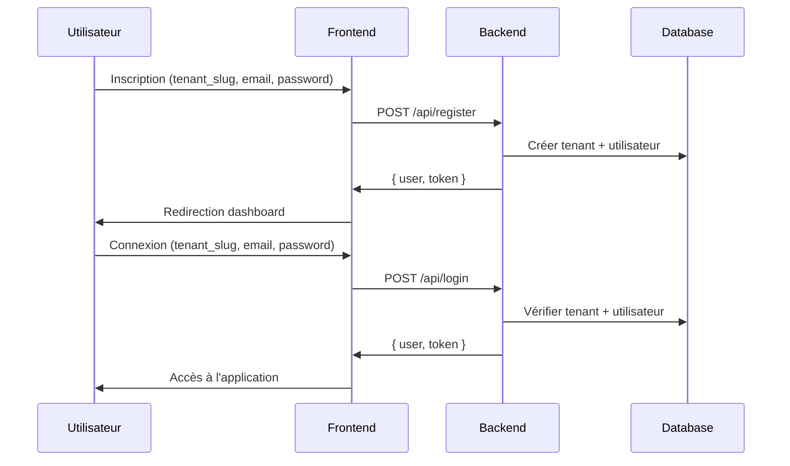

# 🚀 Application de Gestion Multi-Tenant

> **Frontend Next.js** pour une application de gestion de projets et tâches avec architecture multi-tenant

[](https://nextjs.org/)
[](https://www.typescriptlang.org/)
[](https://tailwindcss.com/)
[](https://tanstack.com/query)

## 📋 Table des matières

- [🎯 Vue d'ensemble](#-vue-densemble)
- [🏗️ Architecture](#️-architecture)
- [🛠️ Stack technique](#️-stack-technique)
- [🚀 Installation](#-installation)
- [📁 Structure du projet](#-structure-du-projet)
- [🔐 Authentification Multi-Tenant](#-authentification-multi-tenant)
- [📊 Fonctionnalités](#-fonctionnalités)
- [🎨 Interface utilisateur](#-interface-utilisateur)
- [🔧 Configuration](#-configuration)
- [📡 API Backend](#-api-backend)
- [🚀 Déploiement](#-déploiement)

## 🎯 Vue d'ensemble

Cette application web moderne offre une solution complète de gestion de projets et tâches avec une architecture **multi-tenant** robuste. Chaque organisation dispose de son propre espace isolé, garantissant la sécurité et la confidentialité des données.

### ✨ Caractéristiques principales

- 🏢 **Multi-tenant** : Isolation complète des données par organisation
- 🔐 **Authentification sécurisée** : JWT avec Laravel Sanctum
- 📊 **Dashboard interactif** : Statistiques en temps réel
- 📋 **Gestion de projets** : CRUD complet avec interface moderne
- ✅ **Gestion de tâches** : Système avancé avec filtres et priorités
- 🎨 **Interface moderne** : Design responsive avec Tailwind CSS
- ⚡ **Performance optimisée** : React Query pour la gestion du cache

## 🏗️ Architecture

### Architecture générale

```
┌─────────────────┐    ┌─────────────────┐    ┌─────────────────┐
│   Frontend      │    │   Backend       │    │   Database      │
│   Next.js 14    │◄──►│   Laravel 11    │◄──►│   MySQL         │
│   TypeScript    │    │   API REST      │    │   Multi-tenant  │
│   React Query   │    │   Sanctum       │    │   UUIDs         │
└─────────────────┘    └─────────────────┘    └─────────────────┘
```

### Flux d'authentification Multi-Tenant



## 🛠️ Stack technique

### Frontend
- **Framework** : Next.js 14 avec App Router
- **Language** : TypeScript 5.0
- **Styling** : Tailwind CSS 3.3.0
- **UI Components** : shadcn/ui
- **State Management** : Zustand + React Query
- **HTTP Client** : Axios avec intercepteurs
- **Icons** : Lucide React

### Backend
- **Framework** : Laravel 11
- **Authentication** : Laravel Sanctum
- **Database** : MySQL avec UUIDs
- **Multi-tenant** : Middleware de scoping
- **API** : REST avec validation

## 🚀 Installation

### Prérequis
- Node.js 18+ 
- npm ou yarn
- Backend Laravel configuré

### 1. Cloner le projet
```bash
git clone <repository-url>
cd gestion-frontend
```

### 2. Installer les dépendances
```bash
npm install
```

### 3. Configuration
```bash
# Copier le fichier d'environnement
cp .env.example .env.local

# Configurer les variables d'environnement
NEXT_PUBLIC_API_URL=http://localhost:8000/api
```

### 4. Démarrer le serveur de développement
```bash
npm run dev
```

L'application sera accessible sur [http://localhost:3000](http://localhost:3000)

## 📁 Structure du projet

```
src/
├── app/                          # App Router Next.js
│   ├── (auth)/                   # Groupe de routes d'authentification
│   │   ├── login/                # Page de connexion
│   │   └── register/             # Page d'inscription
│   ├── (dashboard)/              # Groupe de routes protégées
│   │   ├── dashboard/            # Dashboard principal
│   │   ├── projects/             # Gestion des projets
│   │   │   └── [id]/            # Détail d'un projet
│   │   ├── tasks/               # Gestion des tâches
│   │   └── layout.tsx           # Layout du dashboard
│   ├── globals.css              # Styles globaux
│   └── layout.tsx               # Layout racine
├── components/                   # Composants réutilisables
│   ├── layout/                  # Composants de layout
│   │   ├── header.tsx           # En-tête du dashboard
│   │   └── sidebar.tsx          # Barre latérale
│   ├── projects/                # Composants projets
│   │   └── project-dialog.tsx   # Dialog création/édition
│   ├── tasks/                   # Composants tâches
│   │   ├── task-dialog.tsx      # Dialog création/édition
│   │   └── task-list.tsx        # Liste des tâches
│   ├── ui/                      # Composants UI (shadcn/ui)
│   └── providers.tsx            # Providers React Query
├── hooks/                       # Hooks personnalisés
│   ├── useProjects.ts           # Hooks pour les projets
│   └── useTasks.ts              # Hooks pour les tâches
├── lib/                         # Utilitaires
│   ├── api.ts                   # Configuration Axios
│   └── utils.ts                 # Fonctions utilitaires
└── store/                       # Store Zustand
    └── authStore.ts             # Store d'authentification
```

## 🔐 Authentification Multi-Tenant

### Flux d'inscription
1. **Création du tenant** : L'organisation est créée automatiquement
2. **Utilisateur admin** : Premier utilisateur avec rôle admin
3. **Token JWT** : Authentification sécurisée
4. **Isolation** : Données automatiquement scoped

### Flux de connexion
1. **Sélection tenant** : Via `tenant_slug`
2. **Vérification** : Email + mot de passe + tenant
3. **Token JWT** : Session sécurisée
4. **Redirection** : Dashboard avec données isolées

### Sécurité
- **Middleware** : Protection des routes sensibles
- **Scoping** : Isolation automatique des données
- **Tokens** : JWT avec expiration
- **Validation** : Côté frontend et backend

## 📊 Fonctionnalités

### 🏠 Dashboard
- **Statistiques** : Projets actifs, tâches totales, progression
- **Vue d'ensemble** : Tâches récentes et échéances
- **Navigation** : Accès rapide aux sections

### 📁 Gestion des projets
- **CRUD complet** : Création, lecture, mise à jour, suppression
- **Statuts** : Actif, Terminé, Archivé
- **Relations** : Projets liés aux tâches
- **Interface** : Dialogs modernes et responsive

### ✅ Gestion des tâches
- **CRUD avancé** : Système complet de gestion
- **Filtres** : Par statut, priorité, projet, recherche
- **Priorités** : Basse, Moyenne, Haute
- **Statuts** : À faire, En cours, Terminé
- **Assignation** : Utilisateurs assignés
- **Échéances** : Dates de fin avec alertes

### 🎨 Interface utilisateur
- **Design moderne** : Interface claire et intuitive
- **Responsive** : Adaptation mobile/desktop
- **Accessibilité** : Composants accessibles
- **Thème** : Support clair/sombre
- **Animations** : Transitions fluides

## 🎨 Interface utilisateur

### Composants shadcn/ui
- **Button** : Boutons avec variantes
- **Card** : Cartes et conteneurs
- **Dialog** : Modales et popups
- **Input** : Champs de saisie
- **Select** : Sélecteurs dropdown
- **AlertDialog** : Confirmations
- **Badge** : Indicateurs visuels

### Design System
- **Couleurs** : Palette cohérente
- **Typographie** : Hiérarchie claire
- **Espacement** : Grille harmonieuse
- **Icônes** : Lucide React
- **Animations** : Transitions CSS

## 🔧 Configuration

### Variables d'environnement
```env
# API Backend
NEXT_PUBLIC_API_URL=http://localhost:8000/api

# Base URL (production)
NEXT_PUBLIC_BASE_URL=https://your-domain.com
```

### Configuration TypeScript
```json
{
  "compilerOptions": {
    "paths": {
      "@/*": ["./src/*"]
    }
  }
}
```

### Configuration Tailwind
```typescript
// tailwind.config.ts
export default {
  content: ['./src/**/*.{ts,tsx}'],
  theme: {
    extend: {
      colors: {
        // Variables CSS pour les thèmes
      }
    }
  }
}
```

## 📡 API Backend

### Endpoints d'authentification
```typescript
POST /api/register    // Inscription avec création tenant
POST /api/login       // Connexion avec tenant_slug
GET  /api/me          // Informations utilisateur
POST /api/logout      // Déconnexion
```

### Endpoints projets
```typescript
GET    /api/projects     // Liste des projets
POST   /api/projects     // Créer un projet
GET    /api/projects/:id // Détail d'un projet
PUT    /api/projects/:id // Modifier un projet
DELETE /api/projects/:id // Supprimer un projet
```

### Endpoints tâches
```typescript
GET    /api/tasks        // Liste des tâches
POST   /api/tasks        // Créer une tâche
GET    /api/tasks/:id    // Détail d'une tâche
PUT    /api/tasks/:id    // Modifier une tâche
DELETE /api/tasks/:id    // Supprimer une tâche
```

### Sécurité Multi-Tenant
- **Middleware** : `TenantScope` injecte `tenant_id`
- **Scoping** : Global scopes sur les modèles
- **Isolation** : Chaque tenant voit ses données uniquement

## 🚀 Déploiement

### Build de production
```bash
npm run build
npm start
```

### Variables d'environnement (production)
```env
NEXT_PUBLIC_API_URL=https://api.your-domain.com/api
NEXT_PUBLIC_BASE_URL=https://your-domain.com
```

### Optimisations
- **Code splitting** : Chargement optimisé
- **Image optimization** : Next.js Image
- **Bundle analysis** : Analyse des performances
- **SEO** : Métadonnées optimisées

## 📈 Performance

### Métriques
- **First Load JS** : ~84KB partagé
- **Page Size** : Optimisé par route
- **Cache** : React Query intelligent
- **Bundle** : Code splitting automatique

### Optimisations
- **Lazy loading** : Composants à la demande
- **Memoization** : React.memo et useMemo
- **Cache** : React Query avec staleTime
- **Images** : Next.js Image optimization

## 🤝 Contribution

### Scripts disponibles
```bash
npm run dev          # Serveur de développement
npm run build        # Build de production
npm run start        # Serveur de production
npm run lint         # Linting ESLint
```

### Standards de code
- **TypeScript** : Typage strict
- **ESLint** : Règles Next.js
- **Prettier** : Formatage automatique
- **Conventions** : Nommage cohérent

## 📄 Licence

Ce projet est sous licence MIT. Voir le fichier `LICENSE` pour plus de détails.

---

**Développé avec ❤️ en Nextjs**